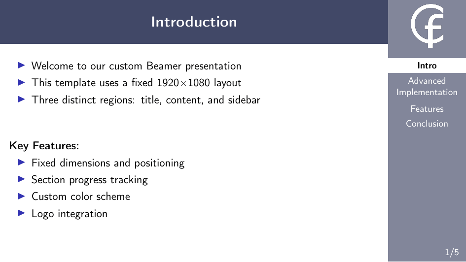

# Custom LaTeX Beamer Presentation Template

This project provides a custom LaTeX Beamer template for creating modern, clean presentations with a fixed 1920x1080 aspect ratio. The layout is built using TikZ for precise, pixel-perfect control over element positioning, creating a professional look with a title bar, a main content area, and a dynamic sidebar.



## Key Features

* **Fixed 1920x1080 Layout**: Designed with a 16:9 aspect ratio, perfect for modern displays.
* **Customizable Sidebar**: The sidebar dynamically tracks and displays the presentation sections.
* **Two Navigation Modes**:
    * **`presentation` mode**: The sidebar shows only the sections you have visited so far.
    * **`navigation` mode**: The sidebar shows *all* sections from the beginning. This mode requires **two compilations** to work correctly.
* **Easy Customization**: The logo and color scheme can be easily modified. The template uses a custom class file (`beamer-template.cls`) for a clear separation of content and style.
* **Simple Slide Creation**: A single macro, `\FullSlide`, is used to generate each slide, simplifying the document structure.

---

## File Structure

* `beamer-template.cls`: The custom class file that defines the entire layout, colors, and logic.
* `sample-presentation.tex`: An example presentation demonstrating how to use the template and its features.
* `Makefile`: Contains a `clean` command to remove auxiliary LaTeX files.

---

## Requirements

The template requires the following LaTeX packages, which are loaded by the `.cls` file:
* `tikz`
* `xcolor`
* `graphicx`
* `etoolbox`
* `xstring`

## Usage

### 1. Document Setup

To use the template, set the document class to `beamer-template`. You can choose between two options: `presentation` (default) or `navigation`.

**For a sidebar that shows visited sections:**
```latex
\documentclass[presentation]{beamer-template}
```
**For a sidebar that shows all sections (requires compiling twice):**
```latex
\documentclass[navigation]{beamer-template}
```

### 2. Customizing the Logo

To change the logo displayed in the sidebar, redefine the \logopath command in your main .tex file's preamble.

```latex
\renewcommand{\logopath}{path/to/your/logo.png}
```

### 3. Creating Slides

Each slide is created using the \FullSlide command, which takes three arguments:
    1. Slide Title: The text displayed in the top title bar.
    2. Section Name: A unique identifier for the section. Slides with the same section name are grouped together in the sidebar.
    3. Content: The main content of your slide.

```latex
\FullSlide{My Slide Title}{Section One}{%
  % Your slide content, like text, lists, and images, goes here.
  \begin{itemize}
    \item This is my first point.
    \item This is my second point.
  \end{itemize}
}
```

## Compilation

If you are using the default presentation option, you only need to compile the document once.

```bash
pdflatex sample-presentation.tex
```

The navigation mode needs two compilation passes to function correctly. The first pass scans the document and writes all section names to the .aux file. The second pass reads this file to build the complete list of sections for the sidebar.

```bash
pdflatex sample-presentation.tex
pdflatex sample-presentation.tex
```

## Cleaning Up Auxiliary Files

A Makefile is included to help clean up the temporary files generated by LaTeX (e.g., .aux, .log, .nav, .snm). To use it, simply run the clean command in your terminal. This command is defined as a .PHONY rule, meaning make will execute the command instead of looking for a file named "clean".

```bash
make clean
```